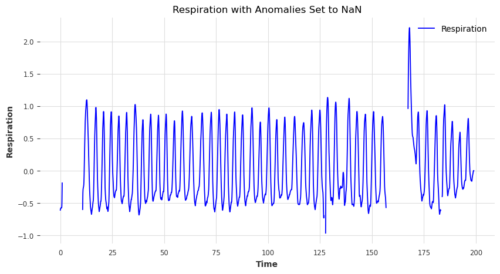

# RespFlow: Python Toolkit for Respiratory Data Processing 

RespFlow is a comprehensive Python toolkit for preprocessing, anomaly detection, and interpolation of respiratory time series data. It integrates:

- **ApplyBandpass**: Zero‑phase Butterworth bandpass filtering
- **Preprocessing**: Batch filtering of raw CSV files with `ApplyBandpass`
- **anomaly\_det**: Multi‑method anomaly detection (Quantile, IQR, Autoregression)
- **DataCleaning**: End‑to‑end pipeline for anomaly removal, trimming, and spline interpolation

Example outputs are stored in the `images/` folder and referenced below.

---

## Preliminary Notebook

Before building **RespFlow**, an exploratory Jupyter notebook was used to prototype and evaluate signal‑processing and anomaly‑detection workflows. It contains:

- Initial bandpass filter experiments and parameter tuning
- Visualization of raw vs. filtered respiratory waveforms
- Early anomaly detection trials (quantile, IQR, autoregression)
- Spline interpolation and gap‑filling prototypes

You can find this notebook in the `notebooks/` directory; it documents the step‑by‑step research that led to the final, streamlined functions below.

---

## Installation

```bash
git clone https://github.com/yourusername/RespFlow.git
cd RespFlow
python -m venv venv
source venv/bin/activate       # On Windows: venv\\Scripts\\activate
pip install -r requirements.txt
```

---

## Functions

### 1. `ApplyBandpass`

Apply a zero‑phase Butterworth bandpass filter to a respiration signal.

```python
filtered = ApplyBandpass(
    df,               # DataFrame with 'Time', 'Respiration', 'Events'
    sm_rate=2000,     # Sampling rate in Hz
    lw_cut=0.05,      # Low‑cut frequency in Hz
    hg_cut=2.0,       # High‑cut frequency in Hz
    order=5,          # Filter order
    output='None'     # File path for output CSV (or 'None')
)
```

### 2. `Preprocessing`

Batch‑process all raw CSVs under a directory, apply `ApplyBandpass`, and save filtered outputs organized in numbered subfolders.

```python
Preprocessing(
    input_raw_dir,       # e.g. 'data/0_raw'
    output_filtered_dir, # e.g. 'data/1_filtered'
    sm_rate=2000,
    lw_cut=0.05,
    hg_cut=2.0,
    order=5
)
```

### 3. `anomaly_det`

Detect anomalies in a respiration series using three methods and return a binary mask:

```python
y_mask, df_detected = anomaly_det(
    df,                 # DataFrame with 'Time' & 'Respiration'
    verbose=True,
    AD_c=4,
    AD_side="both",
    AD_n_steps=3,
    AD_step_size=50,
    Return_vals=True
)
```


### 4. `DataCleaning`

One‑stop function to:

1. Remove anomalies
2. Trim initial NaNs
3. Spline‑interpolate small gaps
4. Trim trailing NaNs

```python
clean_df = DataCleaning(
    'data/1_filtered/01/1_01-02-01.csv',
    AD_c=4,
    AD_side="both",
    AD_n_steps=3,
    AD_step_size=50,
    spline_s=1.0,
    spline_k=3,
    head_trim_secs=5.0,
    spline_gap_max=1.0,
    verbose=True,
    show_plots=True
)
```

#### Example Results:

**Raw vs. RespFlow Cleaning**\


**Anomalies Detection Comparisons**\


**Signal With Anomalies Removed**\


---

For detailed parameter descriptions and advanced usage, refer to the docstrings in each function.